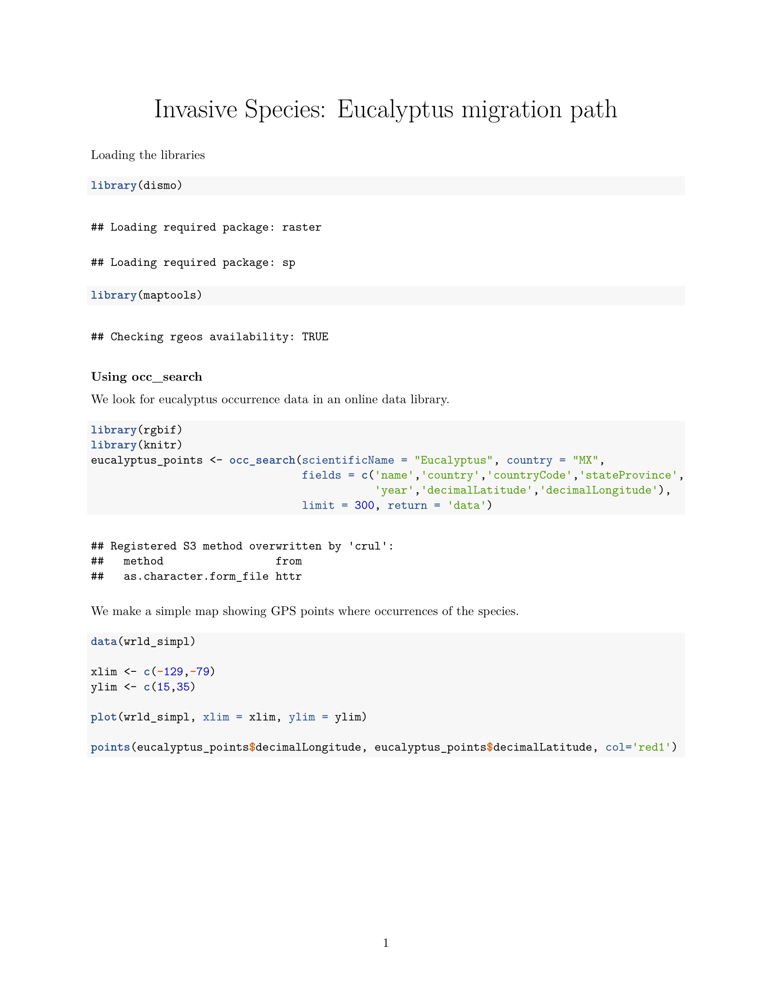
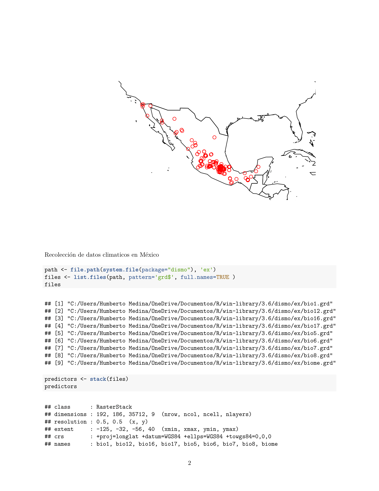
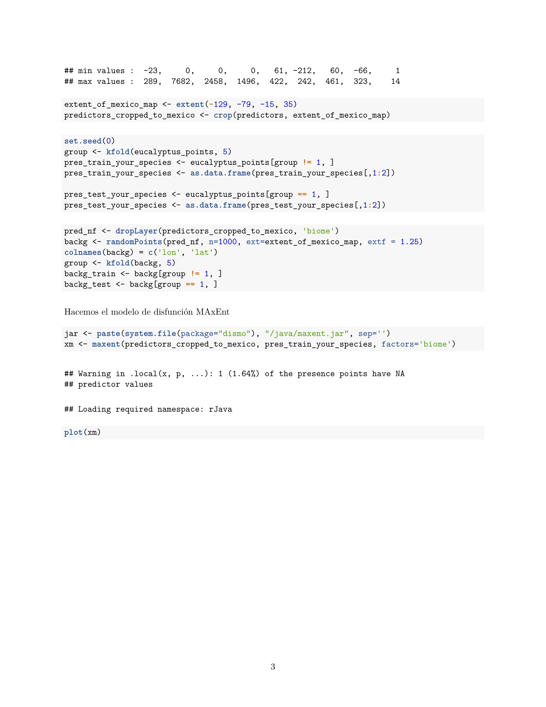
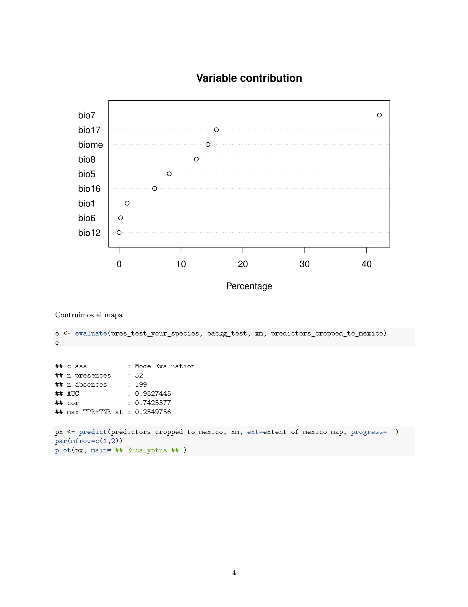
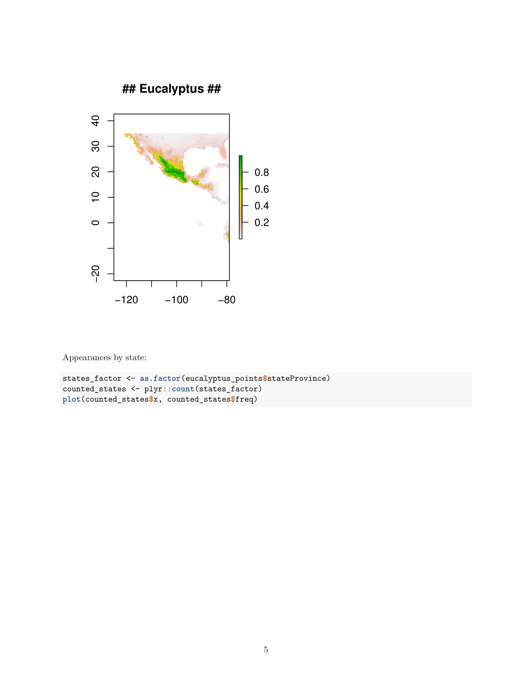
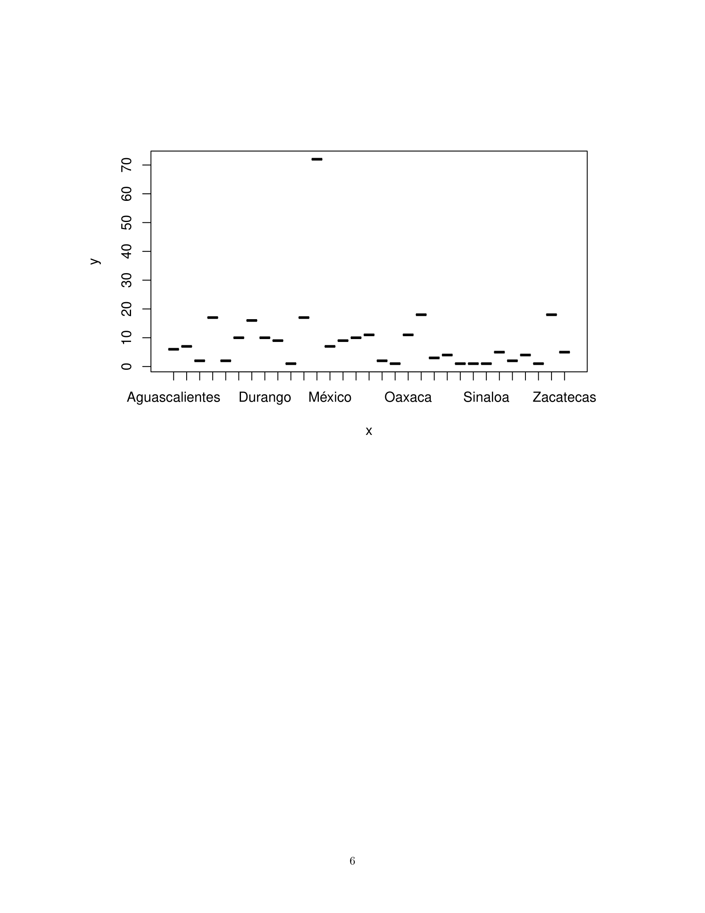

# Invasive Species: Migration Paths using R
Hi! this is a R script that traces the most likely areas invasive species could migrate, according to environmental factors, related to the occurrence of this species.

## Notebook

